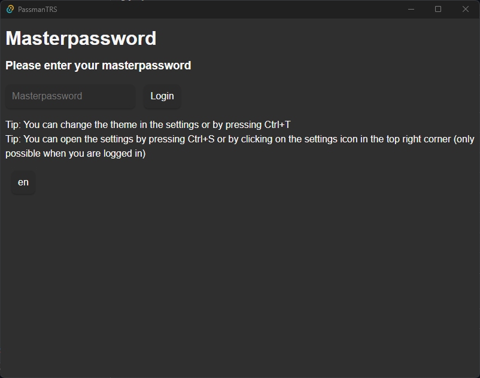
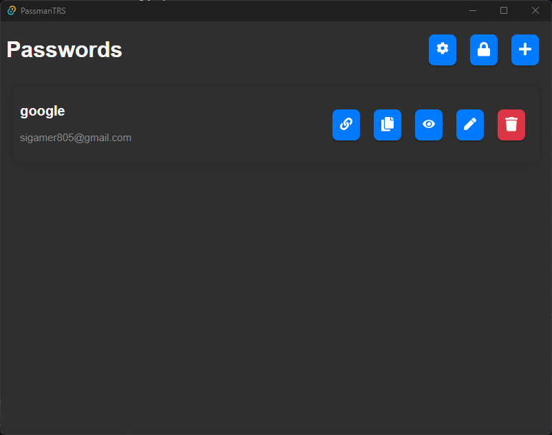
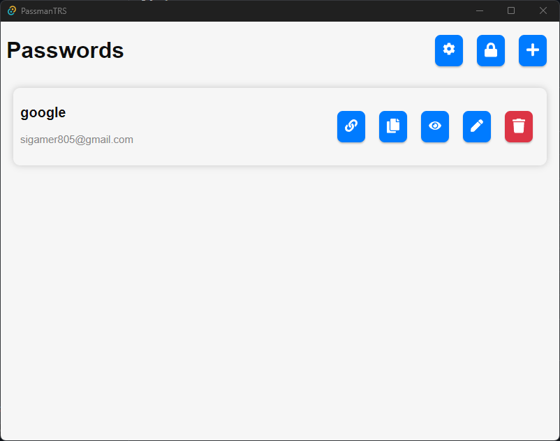
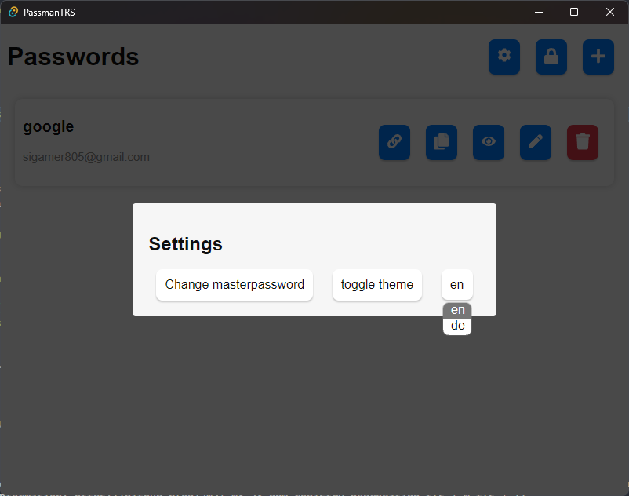
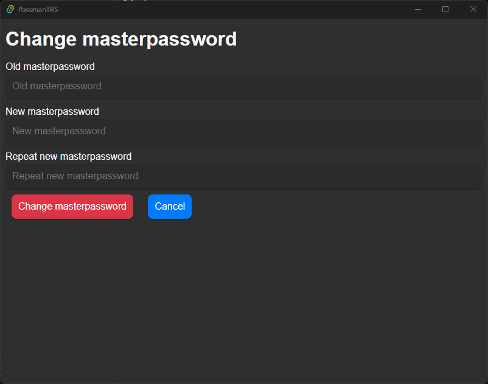

# PassmanTRS
## PassmanTRS is a password manager that uses [Tauri](https://tauri.app/) and [Rust](https://www.rust-lang.org/). It is currently in development and I don't recommend depending on it.
## Features
- [x] Available for Windows, Linux and Mac
- [x] Available in English and German
- [x] basic password storage
- [x] basic password retrieval
- [x] password deletion
- [x] password editing
- [x] master password encrypted in bcrypt
- [x] password encrypted in AES-256-GCM
- [x] copy to clipboard
- [x] Dark & Light theme
- [x] settings
- [x] master password change
- [x] password generation
- [x] password generation history
- [x] search *in the next release*
- [x] password strength meter *in the next release*

## Upcoming Features
- [ ] password sharing
- [ ] password expiration
- [ ] password import/export
- [ ] easy vault backup

## Screenshots

## News
- ⌈ 11.04.2024: [v0.1.5 released](https://github.com/gamersi/PassmanTRS/releases/tag/app-v0.1.5)
- | 05.02.2024: [v0.1.4 released](https://github.com/gamersi/PassmanTRS/releases/tag/app-v0.1.4)
- | 21.01.2024: [v0.1.3 released](https://github.com/gamersi/PassmanTRS/releases/tag/app-v0.1.3)
- | 08.01.2024: [v0.1.2 released](https://github.com/gamersi/PassmanTRS/releases/tag/app-v0.1.2) (the multilingual release)
- | 07.01.2024: [v0.1.1 released](https://github.com/gamersi/PassmanTRS/releases/tag/app-v0.1.1)
- | 01.01.2024: [v0.1.0 released](https://github.com/gamersi/PassmanTRS/releases/tag/app-v0.1.0)
- | December 2023: Development resumed
- | June 2023: Development paused
- ⌊ May 2023: Development started

## Installation
### Windows
1. Download the latest release from the [releases page](https://github.com/gamersi/PassmanTRS/releases).
2. Install either the .exe or .msi file.
3. Run the application.

### Linux
1. Download the latest release from the [releases page](https://github.com/gamersi/PassmanTRS/releases).
2. Either run the .AppImage file or install the .deb file. You may need to make the .AppImage file executable by running `chmod +x [file].AppImage`.

### Arch Linux
1. You can install the application from the [AUR](https://aur.archlinux.org/packages/passmantrs-bin/) by running `yay -S passmantrs-bin`.

### Mac (Intel only for now)
1. Download the latest release from the [releases page](https://github.com/gamersi/PassmanTRS/releases).
2. Install the .dmg or the .app.tar.gz file by dragging the extracted .app file to your Applications folder.
3. Run the application.

## Building
You can build the application yourself by following these steps:
1. Install [Rust](https://www.rust-lang.org/).
2. Install [Node.js](https://nodejs.org/en/), ideally >= 18 (I have not tested it with older versions and it may not work)
3. Clone the repository by running `git clone https://github.com/gamersi/PassmanTRS.git`.
4. Run `cd PassmanTRS`.
5. Run `npm install`.
6. Run `npm run tauri dev` to run the application in development mode or `npm run tauri build` to build the application.

## Contributing
Feel free to contribute to the project by opening a pull request or an issue. If you have any questions, feel free to open an issue.

## License
This project is licensed under the MIT license. See the [LICENSE](https://github.com/gamersi/PassmanTRS/blob/master/LICENSE) file for more information.

## Translations
- [x] English (en) by @gamersi
- [x] German (de) by @gamersi

### Adding a new translation
If you want to translate the application into your language, you can do so by following these steps:
1. Fork the repository.
2. Create a new folder in the `src/locales` folder with the name of your language in the format `xx` where `xx` is the [ISO 639-1](https://en.wikipedia.org/wiki/List_of_ISO_639-1_codes) code of your language. For example, if you want to translate the application into French, you would create a folder called `fr`.
3. Copy the `en.json` file and rename it as described above, keeping the `.json` extension.
4. Translate the strings in the file.
5. You can add your translation by declaring it in `src/locales/i18n.ts`: add the language code to the `availableLanguages` array and add the import statement as well as the addMessages statement with the language code and the imported file.
6. Add your language and github username to the list above.
7. Open a pull request.
You can also open an issue or contact me on Discord (gamersi) if you need help with the translation.
